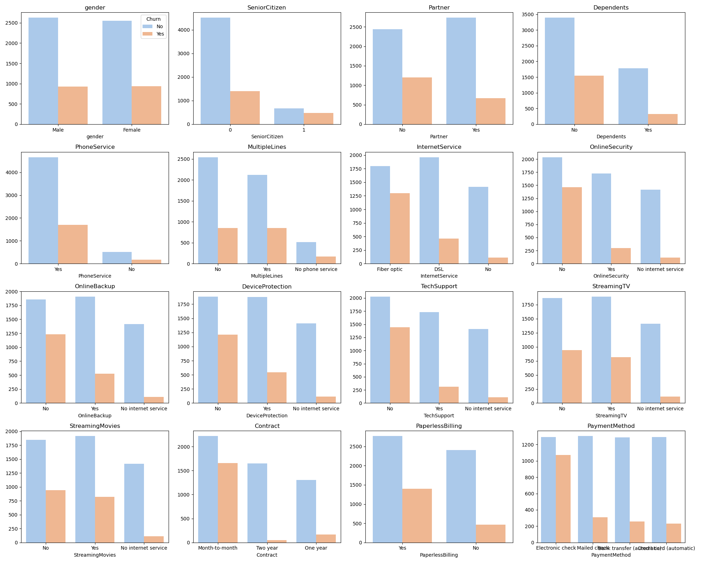
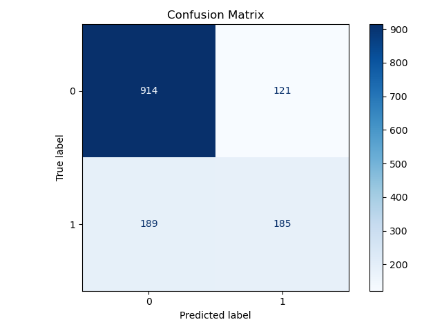
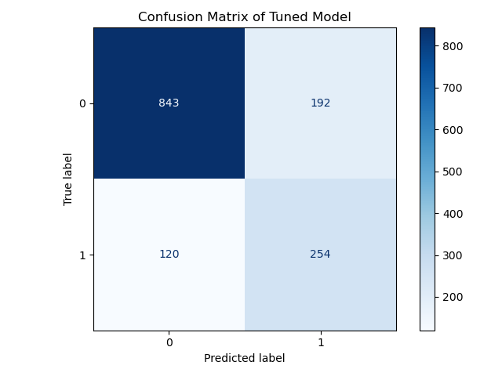
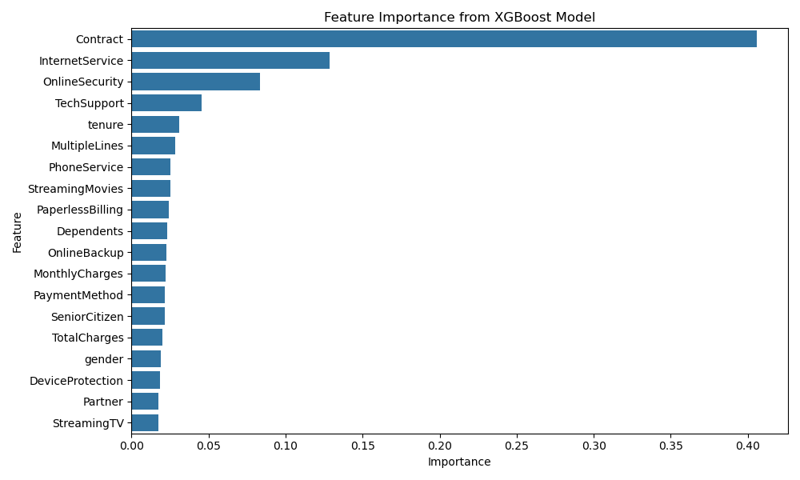

# Telco Customer Churn Prediction

## Introduction

This project focuses on predicting customer churn within a company in the telecommunications industry. Accurately identifying churners is critical for businesses seeking to improve customer retention and develop effective strategies to enhance customer loyalty. By leveraging data-driven insights, this project aims to provide actionable recommendations that help reduce churn and maximize long-term customer value.

## Dataset

The dataset used in this project can be found [here](https://www.kaggle.com/datasets/blastchar/telco-customer-churn/data). It contains information about Telco customers, such as gender, total charges, payment method, and more.

## Objectives

The primary objectives of this project are:

- **Churn Prediction** — Develop a predictive model to accurately determine whether a customer will churn using all available features in the dataset.  
- **Data Analysis** — Explore and analyze the dataset to understand the distributions, relationships, and characteristics of both categorical and continuous variables.  
- **Model Building** — Implement and compare different machine learning algorithms to identify the best approach for churn prediction.  
- **Model Evaluation** — Assess the models using appropriate performance metrics, focusing on minimizing false negatives and ensuring reliable detection of churners.
- **Synthesizing Data** — Test the model on synthesized data similar to the dataset using SDV (Synthethic Data Vault)

---

### Data Preprocessing

To ensure the dataset was ready for modeling, we performed the following preprocessing steps:
  
- **Categorical Encoding** — Converted categorical variables into numerical formats suitable for machine learning models.  
- **Feature Scaling** — Applied scaling techniques to standardize numerical features, improving model training stability and performance.

---

### Exploratory Data Analysis (EDA)

During EDA, we examined both categorical and continuous variables along with the target variable. Specifically, we analyzed the distribution and frequency counts of each feature to identify patterns, imbalances, and potential data quality issues.

Example plots: 
---

### Model Development

We implemented and compared several machine learning algorithms to predict customer churn:

- **XGBoost Classifier** — A powerful gradient boosting algorithm known for high accuracy and efficiency.  
- **Random Forest Classifier** — An ensemble method using multiple decision trees to improve robustness and reduce overfitting.

Hyperparameter tuning was conducted to optimize model parameters and enhance predictive performance.

#### Base XGBoost vs Tuned XGBoost Example:

---

### Model Evaluation

Model effectiveness was assessed through multiple performance metrics:

- **Accuracy** — Measures the overall correctness of the model’s churn predictions.  
- **Precision** — Indicates the proportion of predicted churners who actually churned, minimizing false positives.  
- **Recall** — Reflects the model’s ability to identify all actual churners, minimizing false negatives.  
- **F1-Score** — The harmonic mean of precision and recall, providing a balanced measure of model performance.  
- **Confusion Matrix** — Visualizes the true vs. predicted churn classifications to analyze model errors and identify areas for improvement.

The focus was primarily on maximizing the **F1-Score**, as finding a balance between correctly identifying all churners (minimizing false negatives) while maintaining accuracy in predicting actual churns is the most important thing for this project.

I also looked at the important features found by our model:

## Python Packages Used

This project utilizes the following Python packages:

- **scikit-learn** — machine learning tools and utilities  
- **fastai** — deep learning and high-level training library  
- **pandas** — data manipulation and analysis  
- **numpy** — numerical computing and array operations  
- **matplotlib** — plotting and visualization  
- **seaborn** — statistical data visualization built on matplotlib  
- **joblib** — model serialization and efficient pipelining  
- **SDV (Synthetic Data Vault)** — synthetic data generation framework 
